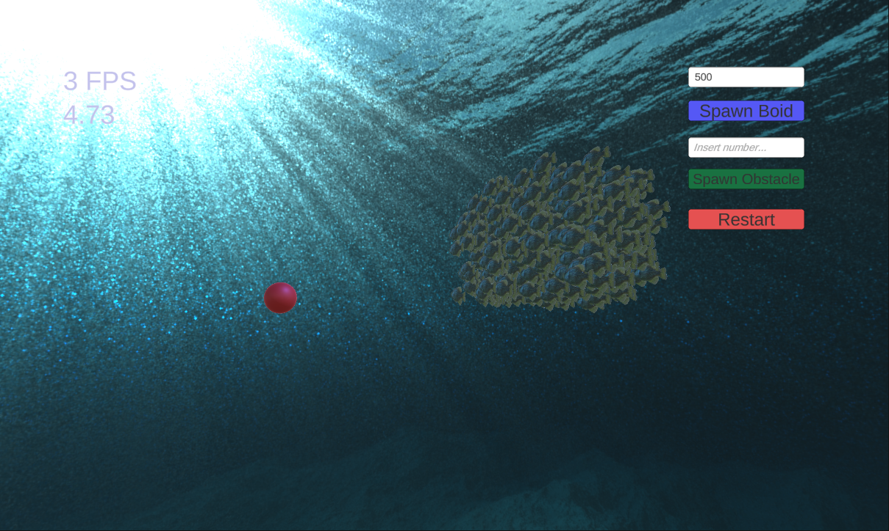

# Flocking Algorithms

## General Desscription
Example scripts from master thesis project. Analysis of different flocking algorithms  

Project consist of two version of flocking algorithm:
- **Basic** - basic implementation of flocking algorithm (not included in this example)
- **Octree** - spaced-division based optimisation of algorithm

As well as optimisation with frame reduce computing.  
Boids can change their movement direction if obstacle appears on their way.

Boids go through path that consist of 5 food.

## Additional Features

There is also user interface implemented in application which consist of:
- **Boid Number Input/Button** which allows user to enter number of boids to spawn
- **Obstacle Number Input/Button** giving user possibilty to spawn number of obstacles that boid should avoid
- **FPS Counter** - which display current number of FPS
- **Timer** - To measure how long boids will go through their path
- **Restart Button** - allowing to restart application

## Presentation Movie
### [Movie](https://drive.google.com/drive/folders/1nthsWbM4u5sMPxfy9Zacw_1zb8NFF7UO?usp=sharing)

## Screenshots
  

## Contact
- Email: [bartosz.pokorski67@gmail.com](mailto:bartosz.pokorski67@gmail.com)
